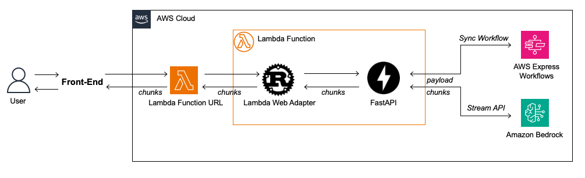

# 🛠️ aws-stepfunctions-exemplos

AWS Step Functions é um serviço de fluxo de trabalho visual low-code. Este repositório inclui exemplos detalhados que ajudarão você a desbloquear o poder do fluxo de trabalho serverless.

## 📚 Exemplos e Postagens de Blog de Apoio

### 🚀 Acelerando Cargas de Trabalho Usando Paralelismo no AWS Step Functions

Neste exemplo, você usa o AWS Step Functions para criar um aplicativo que usa processamento paralelo para concluir quatro horas de trabalho em cerca de 60 segundos.

- [Postagem do blog: Acelerando cargas de trabalho usando paralelismo no AWS Step Functions](Link do blog aqui)

### 🔄 Controlando a Simultaneidade em Sistemas Distribuídos Usando AWS Step Functions

Neste exemplo, você usa o AWS Step Functions para controlar a simultaneidade no seu sistema distribuído. Isso ajuda a evitar a sobrecarga de recursos limitados no seu pipeline de processamento de dados sem servidor ou a reduzir o risco de disponibilidade controlando a velocidade nos seus fluxos de trabalho de automação de TI.

- [Postagem do blog: Controlando a simultaneidade em sistemas distribuídos usando AWS Step Functions](Link do blog aqui)

### 🧪 Simulação de Integrações de Serviços com Step Functions Local

Neste exemplo, você usa o AWS Step Functions' Local para testar uma máquina de estado simulando as chamadas de serviço. Você pode encontrar detalhes no arquivo README do exemplo.

- [Postagem do blog: Simulação de integrações de serviços com AWS Step Functions Local](Link do blog aqui)

### 🗃️ Orquestrando a Recuperação de Objetos do S3 Glacier Deep Archive Usando Step Functions

Neste exemplo, você usa o AWS Step Functions para orquestrar a restauração de objetos S3 do S3 Glacier Deep Archive. Você pode encontrar detalhes no arquivo README do exemplo.

- [Postagem do blog: Orquestrando a recuperação de objetos do S3 Glacier Deep Archive usando Step Functions](Link do blog aqui)

### 🎬 Detecção e Edição de Segmentos de Vídeo com o Uso de AWS Step Functions

Este fluxo de trabalho tem como objetivo mostrar como aproveitar o AWS Step Functions para executar tarefas típicas de edição de vídeo. Especificamente, o exemplo usa um vídeo que tem barras de cores SMPTE de duração aleatória no início. O fluxo de trabalho obterá um vídeo de demonstração do S3, o colocará no Amazon Rekognition para detectar segmentos e, em seguida, o Amazon MediaConvert removerá o segmento de vídeo inicial (barras de cores SMPTE). Você pode encontrar detalhes no arquivo README do exemplo.

- [Postagem do blog: Fluxos de trabalho de baixo código com AWS Elemental MediaConvert](Link do blog aqui)

## 🔍 Demonstrações dos Recursos do Step Functions

### 🧪 Funções de Demonstração de Etapas

#### 🧩 Testes Locais com Integrações de Serviços Simulados Usando Estruturas de Teste Java (JUnit e Spock)

Nesta demonstração, você pode aprender como usar JUnit ou Spock para executar testes Step Functions Local. Isso é útil se seus aplicativos serverless atuais forem criados em torno de Java. Com essa abordagem, você pode aproveitar as ferramentas de teste Java existentes.

#### 📱 Aplicativo de Demonstração

### 📝 Demonstração de ASL

Esta demonstração ilustra os recursos do ASL e do AWS Step Functions, incluindo funções intrínsecas e processamento de caminho JSON.

Você pode implantar isso usando SAM ou independentemente como um modelo CloudFormation no AWS Console.

### 🎥 Transcrição de Vídeo com Integrações de Serviços do AWS SDK

Nesta demonstração, você aprenderá a usar as integrações de serviços do AWS SDK para criar um fluxo de trabalho de transcrição de vídeo.

- [Postagem do blog: Agora — AWS Step Functions oferece suporte a 200 serviços da AWS para permitir automação de fluxo de trabalho mais fácil](Link do blog aqui)

## 🌟 Introdução

Nos tempos atuais, onde a velocidade e eficiência são essenciais para o sucesso empresarial, a incorporação de um atendente virtual usando Inteligência Artificial (IA) Generativa tornou-se um elemento crucial para escalar negócios. GenAI oferece uma oportunidade única para empresas de todos os tamanhos automatizarem o atendimento ao cliente, proporcionando respostas rápidas e precisas 24 horas por dia. Isso não só melhora a experiência do cliente, mas também libera recursos humanos para se concentrarem em tarefas mais complexas e estratégicas, potencializando o crescimento sustentável e a capacidade de resposta do negócio no competitivo mercado atual.

Contudo, para que os assistentes virtuais sejam verdadeiramente úteis e relevantes aos negócios, é essencial que tenham acesso à base de conhecimento específica da empresa. A dependência exclusiva da base geral de modelos de linguagem de grande escala (LLMs) não é suficiente para atender às necessidades personalizadas de cada organização, o que torna essencial selecionar e experimentar o modelo de IA correto que se alinhe às peculiaridades e expectativas do negócio. Além disso, é crucial garantir uma baixa latência nas respostas para manter a fluidez e eficácia do atendimento e evitar frustrações dos usuários. A engenharia de prompt também desempenha um papel fundamental, incorporando técnicas avançadas como ReAct e Prompt Chaining, que são essenciais para direcionar a IA de forma eficaz ao longo das conversas.

Neste post, detalharemos uma solução de assistente virtual aprimorada, capaz de atender os desafios de personalização, experimentação e resposta rápida em, por exemplo, serviços de atendimento ao cliente, utilizando AWS Lambda, AWS Step Functions e Amazon Bedrock.

## 🧩 Visão Geral da Solução

Nesta solução de Assistente Virtual com GenAI, exploramos a implementação simplificada de técnicas avançadas de engenharia de prompt e oferecemos flexibilidade para a experimentação com múltiplos modelos, utilizando o Bedrock e os recursos low-code do Step Functions. Além disso, usamos o Lambda com Lambda URL e o AWS Lambda Web Adapter para responder via stream, otimizando assim a latência nas respostas e melhorando a experiência do usuário.

## ⚙️ Como Funciona?

O exemplo usa Lambda para operar uma máquina de estados construída com o Workflow Express Síncrono do AWS Step Functions, projetada especificamente para orquestrar múltiplas solicitações às APIs do Amazon Bedrock.

Inicialmente, a Lambda invoca a máquina de estados, uma implementação de RAG, e a utiliza como entrada para acionar a API InvokeModelWithResponseStream do Bedrock, resultando em uma resposta transmitida em stream ao solicitante. Para essa implementação, utilizamos o AWS Lambda Web Adapter em conjunto com o FastAPI, permitindo que a função Lambda seja acessada por meio de uma URL do Lambda configurada no modo de Response Stream. Graças à resposta em stream, o TTFB (Time to First Byte) é reduzido, melhorando significativamente a experiência do usuário do assistente GenAI e se adequando aos cenários de serviços voltados para os clientes finais via web.

A arquitetura de engenharia de prompt desta solução emprega a técnica de Prompt Chaining, onde as funções Lambda recebem instruções através do parâmetro `system`, guiando o comportamento do modelo desde a primeira invocação. Este parâmetro contém as instruções para o assistente interagir com o usuário, incluindo especificações sobre o papel, o tom e diretrizes gerais para a interação. Inicialmente, o primeiro prompt é crucial para estabelecer técnicas complexas como Role Playing e Few-Shot Prompting.

A Lambda também atua como a última subtarefa do encadeamento de prompts, pronta para utilizar modelos poderosos como os da série Claude. Essa configuração permite a implementação da API InvokeModelWithResponseStream, que, embora envolva modelos com maior tempo de resposta, aproveita o TTFB para oferecer uma resposta com menor latência, melhorando significativamente a responsividade durante as interações com os usuários.

Nas invocações ao Bedrock, definidas nas tarefas do Step Function, cada tarefa que realiza a invocação ao Bedrock pode ter seu próprio prompt. Os prompts devem ser projetados de maneira concisa e direta nas tarefas das Step Functions, com foco na resolução de problemas específicos. Isso incentiva a experimentação com diferentes modelos para otimizar os resultados.

## 🚀 Como Tirar Proveito Deste Padrão?

A combinação de AWS Step Functions usando Workflows Express e a API de resposta em stream do Bedrock permite cenários onde o desenvolvedor pode usar tarefas da máquina de estados para definir subtarefas de encadeamento de prompts (Prompt Chaining).

Cada tarefa da Step Functions pode invocar a API do Amazon Bedrock com um Modelo de LLM específico, sequencialmente ou em paralelo para subtarefas de prompt independentes, e então orquestrar o resultado com outras APIs de serviços AWS, como AWS Lambda, Amazon API Gateway e APIs de terceiros.

Dividir tarefas de LLM em subtarefas facilita a engenharia de prompt, pois permite focar no resultado específico da subtarefa. Também torna mais fácil controlar os tokens de saída, o que reduz a latência das subtarefas que não necessitam gerar grandes saídas.

Por exemplo, você pode usar um prompt de usuário e solicitar a um LLM mais compacto, como o Meta Llama 3 8B, para retornar um valor booleano e usá-lo para definir um caminho determinístico em uma máquina de estados, verificando o valor verdadeiro/falso. Isso consumirá um número reduzido de tokens de saída, diminuindo a latência e o custo. A inferência para uma resposta final pode ser executada por Claude 3 Sonnet usando resposta em stream para melhorar a qualidade da resposta e o TTFB.

Aqui estão alguns cenários onde este padrão pode ser usado:

- **RAG:** Use Step Functions para invocar Bedrock, enriquecendo a entrada do usuário com palavras-chave relevantes ao contexto da conversa e, em seguida, realizar uma busca semântica através das bases de conhecimento do Amazon Bedrock. As tarefas de adicionar palavras-chave e invocar bases de conhecimento, sendo de baixa latência, permitem que a resposta ao usuário seja gerada via stream, melhorando a experiência.
  
- **Router:** Uma máquina de estado do Step Functions pode atuar como um roteador para combinar cenários determinísticos e não determinísticos, como identificar um potencial churn de cliente e iniciar um workflow de retenção.
  
- **Testes A/B:** Utilize testes A/B nas Step Functions para uma implementação rápida e low-code, testando diferentes experimentos, fazendo ajustes e selecionando o melhor para seu negócio. Enquanto se concentra nas regras de negócio, a função Lambda serve como uma abstração de interface, eliminando a necessidade de alterar o código ou o contrato da API para cada experimento.
  
- **Chamadas de API:** A entrada do usuário pode solicitar ao LLM que gere dados em formatos como JSON, XML ou uma consulta SQL baseada em uma estrutura de tabela. Esses dados podem então ser usados pelas Step Functions para realizar tarefas que envolvem chamar APIs e executar consultas SQL em bancos de dados. Além disso, a função Lambda pode utilizar a saída das Step Functions para fornecer respostas em stream e explicar os dados gerados.
